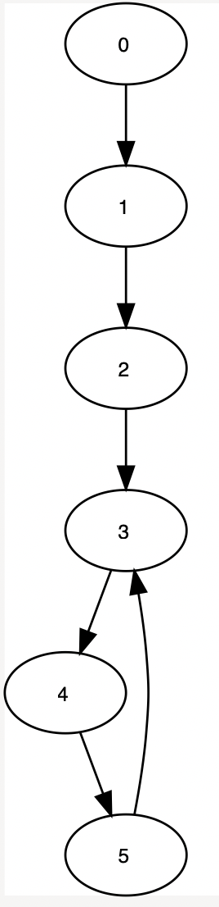

# Identificeren van scharnierpunten

status: afgewerkt
```
preconditie: verbonden graaf
0 is geen scharnierpunt want hij heeft maar 1 kind.
3 is een scharnierpunt voor 4 (en zijn kinderen)
2 is een scharnierpunt voor 3 (en zijn kinderen)
1 is een scharnierpunt voor 2 (en zijn kinderen)
```
