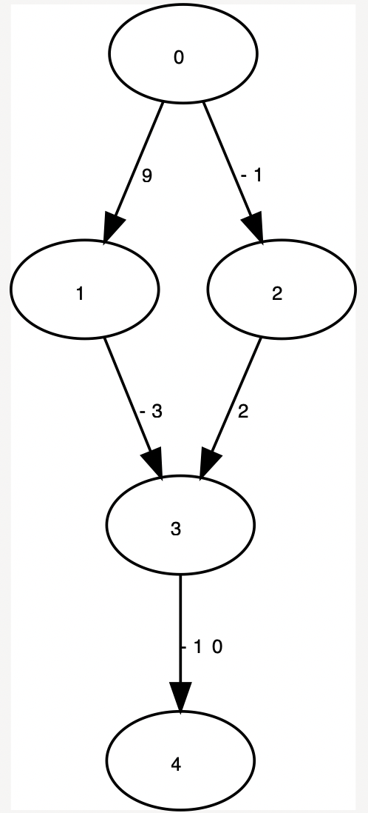
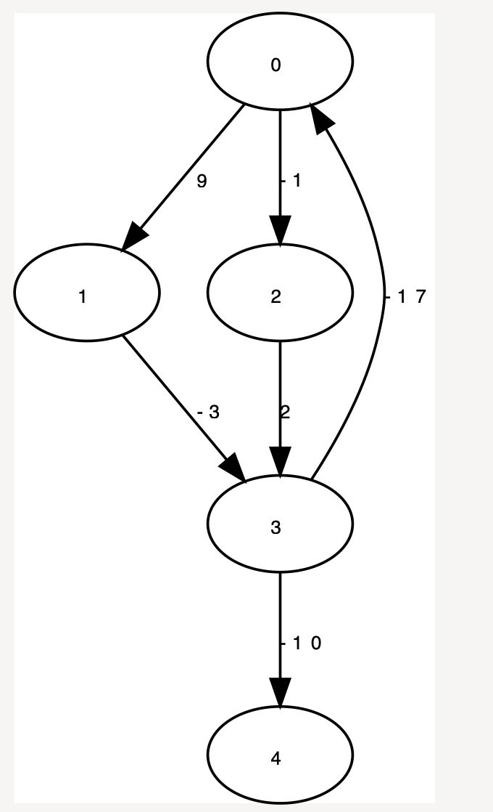

# Bellman-Ford

## Status
- [x] afgewerkt

## Implementatie details
- Optimalisatie 1: Er wordt gebruik gemaakt van het Push-based principe waarbij enkel vertices overwogen worden die buur zijn van een vertex die in de vorige iteratie aangepast zijn geweest. (zie cursus)
- Optimalisatie 2: Vertices die eerder al in de deque gezeten hebben worden vanvoor gepusht (zie cursus)
- Negatieve lussen worden gedetecteerd. Een negatieve lus kan gevonden worden als er v iteraties gebeuren (v-1 is dus het maximum). Dit algoritme maakt echter geen gebruik van een lus die alle knopen doorloopt maar van een while die default stopt wanneer
de deque leeg is. Elke vertex kan maar maximum v-1 keer in deze deque voorkomen. Daarom wordt er een vector bijgehouden die telt hoevaak elk van deze vertices in de deque worden toegevoegd. Zodra er één voor de v-de keer ingestoken wordt, wordt het programma onderbroken
want dan hebben we een negatieve lus. 

## Grafen`
Correcte graaf

Graaf met negatieve lus

## Log
```
Correcte graaf:
Vertex 0 can be reached via -1 with a wait of 0
Vertex 1 can be reached via 0 with a wait of 9
Vertex 2 can be reached via 0 with a wait of -1
Vertex 3 can be reached via 2 with a wait of 1
Vertex 4 can be reached via 3 with a wait of -9

Shortest path: 0 -> 2 -> 3 -> 4 -> end

Incorrecte graaf:
could not solve this graph since it contains negative loops
``