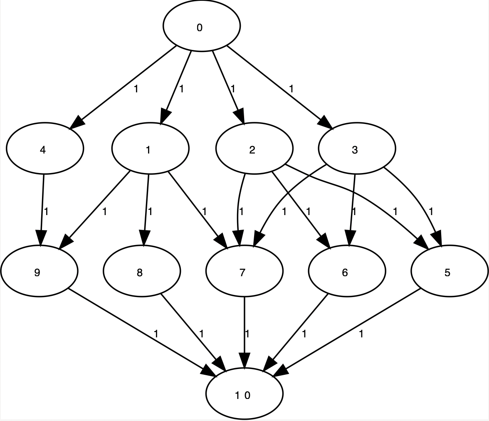
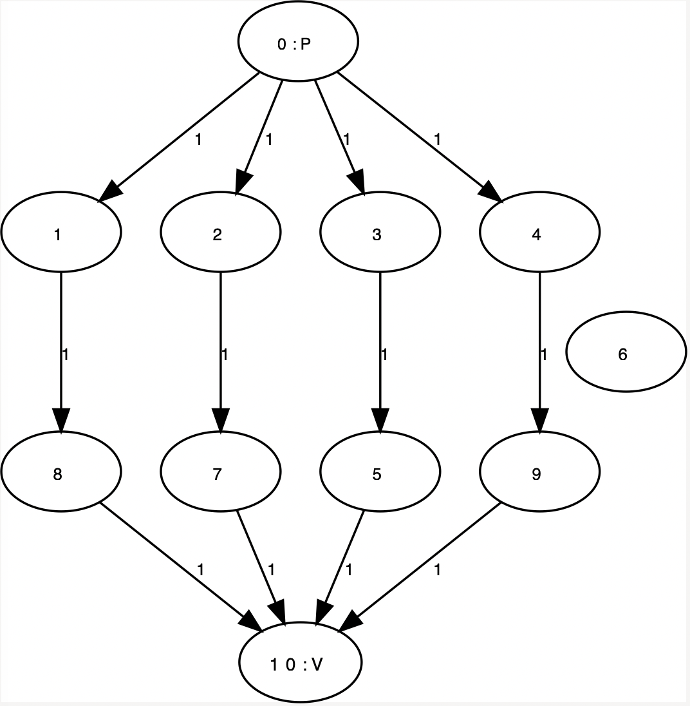

# Koppelen in tweeledige graaf

## status
afgewerkt

## werking

We kunnen zien in hoeveel dagen dit project afgewerkt kan worden. Indien we `aantaldagen` op 1 instellen zien we dat we 
 taak 6 niet kunnen vervolledigen.  Indien we er twee dagen over doen zien we dat we werknemer 4 niet nodig hebben.

Het enigste wat moet gebeuren is de graaf correct aanmaken. Vervolgens pas je het
Ford-Fulkerson toe zoals geïmplementeerd in 08.1 labo -Galadiner`.

## Resultaat
Opgebouwde graaf:  

  
Taakverdeling:  
