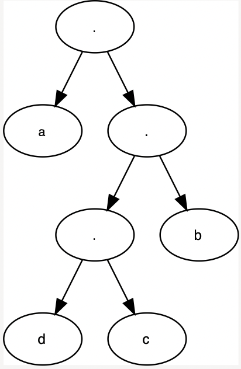

# Huffmancodering

## status
- [x] Opbouwen van een huffmantrie.
- [ ] decode/encode
    - zie labo 10.5. Dit is de voorloper van labo 10.5 waarbij Huffmantries gebruikt worden voor het decoderen van een text

## Werking

- sorteer bos op frequentie  (Kan ook met een prioriteitsqueue)
- merge twee eerste knopen tot 1 boom
- herhaal

## Resultaat

Sample data is `aaaaabbbbbccd`. Zoals je ziet komen a en b vaak voor, zij zitten dan ook hoger in de Huffmantrie.

