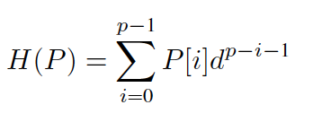
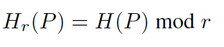
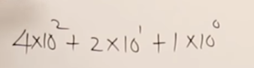
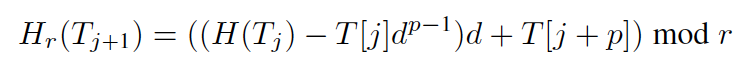
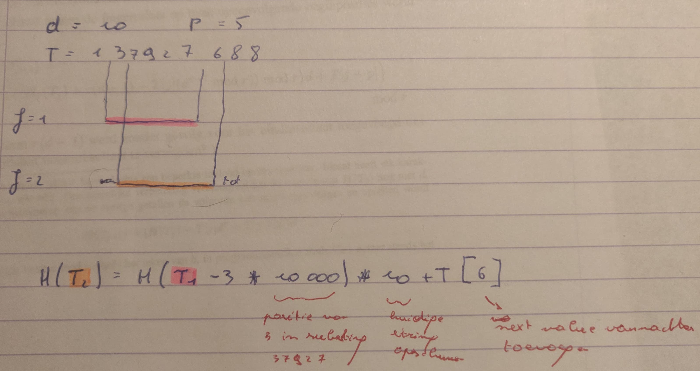

# Karp-Rabin

## Status

- [x] Zoekterm P vertalen naar nummerieke weergave
- [x] Hash van de p eerste tekens uit T hashen
- [x] Hash van T voordurend updaten naarmate we het venster opschuiven.
- [ ] Hashes zijn kleiner dan een processorwoord.
    -  Dit werkte niet waardoor `tmp2` groter werd dan de hash zelf. Daarom zijn alle `mod r` in commentaar gezet.

## Implementatie details
### Hash
- eerst berekenen we de hash van de sleutel en van de [sleutel-lengte] eerste tekens van de tekst.



```c
uint64_t KarpRabin::h(string zt) {
    int p = zt.size();
    int h=0;
    for (int i = 0; i < zt.size(); ++i) {
        h += conv2int(zt[i])*pow(d,(p-i-1));
        h = h % r;
    }
    return h;
}
```

Om ervoor de zorgen dat de hash in een processor woord past mogen we altijd modulo priemgetal doen dat kleiner is dan 2^w. Bij de meeste processoren is deze 64 (bits)  


**Voorbeeld**  
Stel dat we bijvoorbeeld maar 10 letters zouden hebben dan is d=10
a=0, b=1 ... j=9. Het woord "dba" is dan 421



Hier wordt d gelijk gesteld aan 10 omdat dat gemakkelijk rekend. Voor het alfabet gebruiken we bijvoorbeeld d=26 (indien we hoofdletters niet meetellen).
### Rolling hash
Na de hash van de p eerste tekens uit onze tekst te hebben berekend moeten we deze niet voordurend herberekenen. We kunnen telkens
het eerste teken verwijderen en het nieuwe teken opnieuw toevoegen.


```c
   for (int i = 0; i < tekst.size()-p+1; i++) {
        // first we check if the hashes match. If that is the case, we dubbelcheck by verifying the string itself.
        if (rollingtextHash == zoekhash && tekst.substr(i, p) == zoekterm){
            results.push(i);
        }

        //Update hash: role the hash an index futher.
        // First we remove the first value which becomes now out of scope
        rollingtextHash -= conv2int(tekst[i])* pow(d, p-1);
        // move current index
        rollingtextHash *= d;
        // Next we add the new value which just entered the window
        rollingtextHash += conv2int(tekst[i+p]);
        // check if the word still fits in a processor word.
        rollingtextHash %= r;
    }
```
**Voorbeeld**  
Om huidige hash `T_huidig` te vertalen naar hash `T_next` wordt dit dan:  


