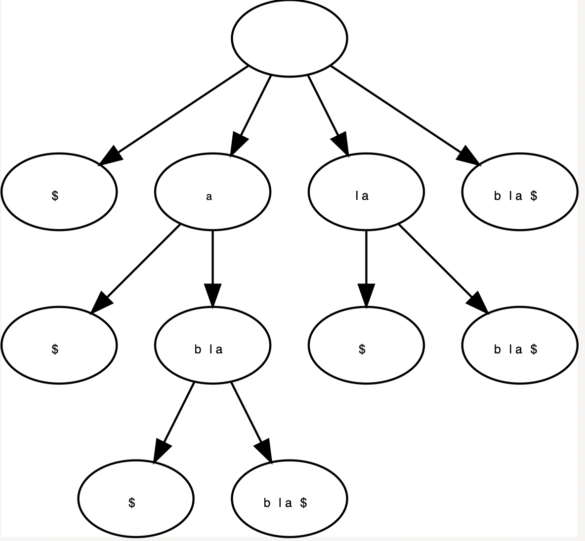

# Suffixbomen

## status
- [x] Toevoegen (Moeten we eigenlijk niet kunnen implementeren aldus Cnops)
    - er zit nog een fout in denk ik.
- [x] Zoeken: alle voorkomens terug geven.
- [ ] LGD tussen twee teksten

## implementatie details
- Enkel indexen worden opgeslagen in de knopen zelf.
- Staartpointers worden gebruikt bij toevoegen
- Afsluitteken: `$`
- Todo: In `Knoop.h` zou niet alles public mogen zijn. Sommige moeten protected zijn.

## Resultaat
Suffix boom voor het woord `blabla`




## Log
```
adding: $
first value, adding $ to root 
adding: a$
root  krijgt kind met suffix a$
adding: la$
terug gaan via staart ptr want : $ != l
root  krijgt kind met suffix la$
adding: bla$
terug gaan via staart ptr want : a != b
terug gaan via staart ptr want : $ != b
root  krijgt kind met suffix bla$
adding: abla$
terug gaan via staart ptr want : l != a
knoop met a$ krijgt kind met suffix abla$
adding: labla$
terug gaan via staart ptr want : b != l
knoop met la$ krijgt kind met suffix labla$
adding: blabla$
knoop met bla$ krijgt kind met suffix blabla$
```
