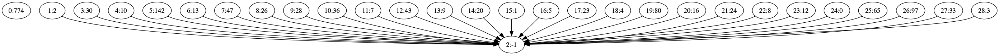

# Labo 5: Handelsreizigersprobleem

status: Afgewerkt


## aanpak

- vind postorder nummering van de graaf
    - opgelet, het is geen verbonden graaf. Dus voor elke knoop moeten we controleren of DEZ er al gepasseerd is.
    ```cpp
      if(visited.find(i) == visited.end()){
                 DEZrec(i, tmp, &visited, g);
             }
    ```
  
- DEZ op elke knoop in omgekeerde graaf in volgorde van post order nummering
    - Opgelet: indien een knoop uit de postorder stack reeds bezocht is geweest in deze fase mogen we deze overslaan.
    ```cpp
  if (visited.find(startpunt) == visited.end()) {
              DEZrec(startpunt, tmpboom, &visited, omgekeerdegraaf);
              bos.push_back(component(convertStackToSet(tmpboom)));
          }
    ```
- Converteer bos naar componenten graaf
- topologisch sorteren (functie van stap 1 opnieuw aanroepen)

## Resultaat
Verkopen aan 39 gezinngen in onderstaande volgorde:  

3 >> 33 >> 97 >> 65 >> 0 >> 12 >> 8 >> 24 >> 16 >> 80 >> 4 >> 23 >> 5 >> 1422 >> 1 >> 20 >> 9 >> 43 >> 7 >> 36 >> 28 >> 26 >> 47 >> 13 >> 142 >> 10 >> 30 >> 32 >> 774 >> 46 >> 19 >> 2 >> 18 >> 11 >> 86 >> 52 >> 6 >> 95 >> 56 >> 


