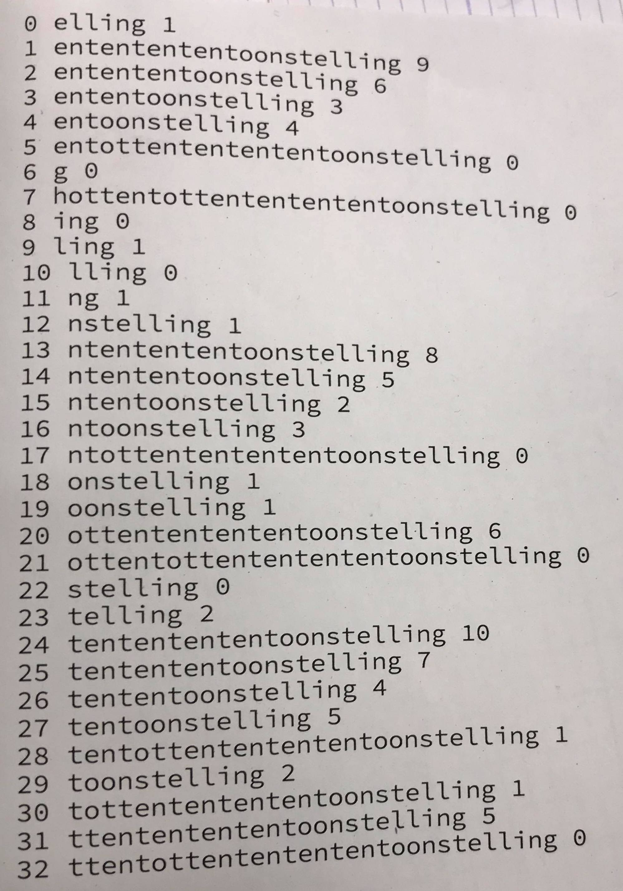

# Suffix tabellen

## status

- De eigenlijke opgave is om deflate te implementeren. Dit is niet gedaan.

- De LCP wordt rechtstreeks opgebouwd zonder de nood van een LGP.

- De LGP wordt opgesteld op de naïve manier maar dit moet nog gecontrolleerd worden op fouten

- De LGP opstellen op de efficiente manier. Dit gebeurd niet. We slaan deze stap over
en slaan het direct op als een LCP. Dit is eigenlijk gewoon een LGP maar in andere volgorde. M.a.w. gaan we tijdens het construeren van de tabel, het direcht opslaan op de juiste LCP plaats. Hierdoor moeten we niet meer alles overlopen met de formule `LCP[i] = LGP[SA[i]]` aangezien we dit direct doen.

## Uitkomst prof

