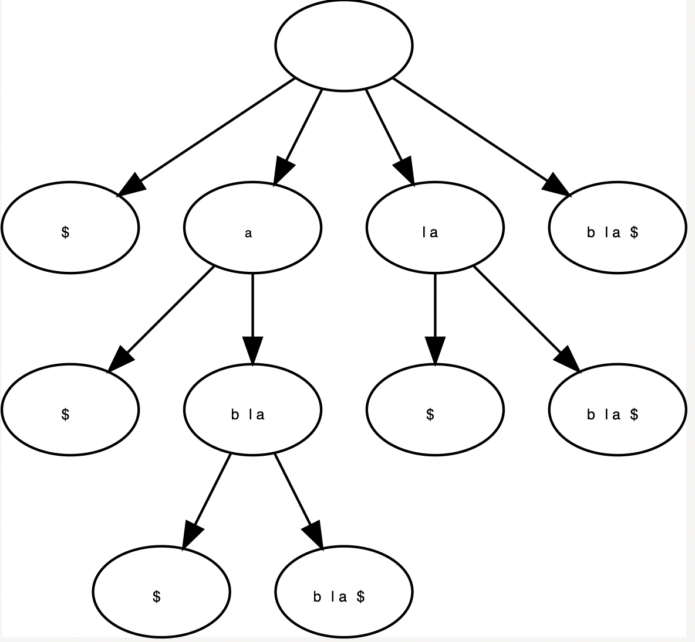

# Suffixbomen

## status
- [x] Toevoegen

## implementatie details
- Enkel indexen worden opgeslagen in de knopen zelf.
- Staartpointers worden gebruikt bij toevoegen

## Resultaat
Suffix boom voor het woord `blabla`

