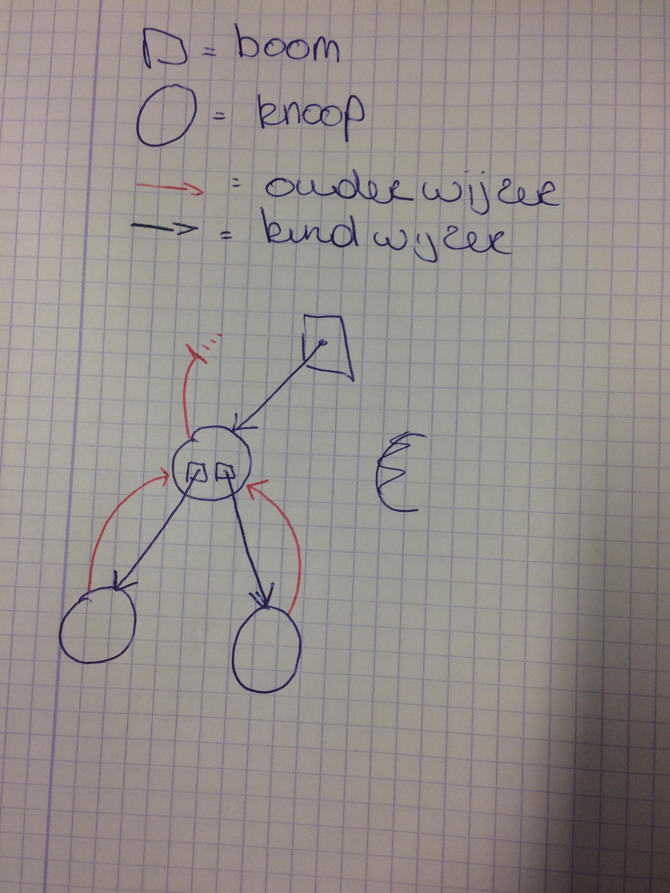
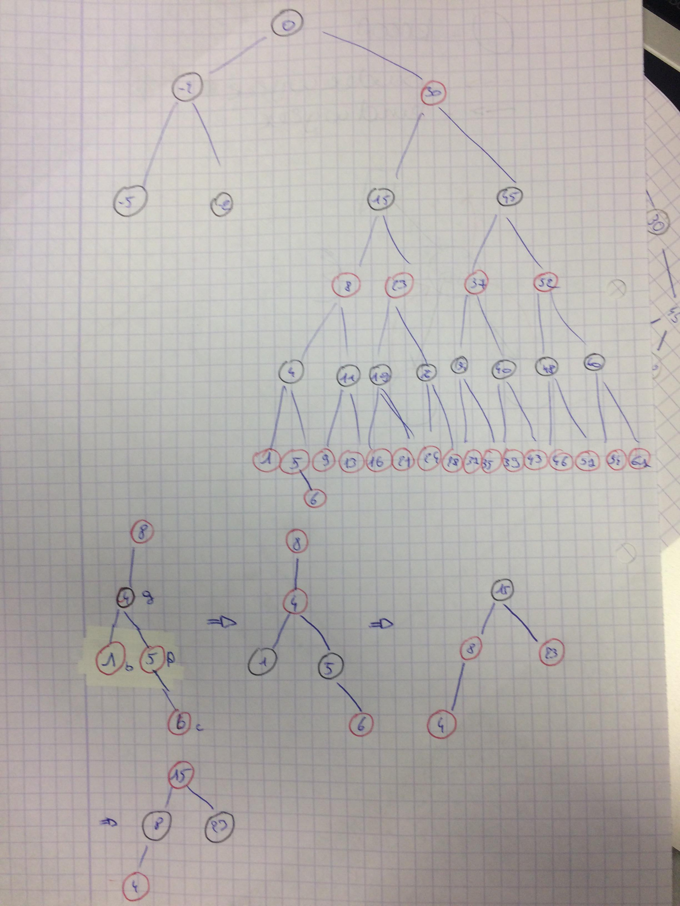
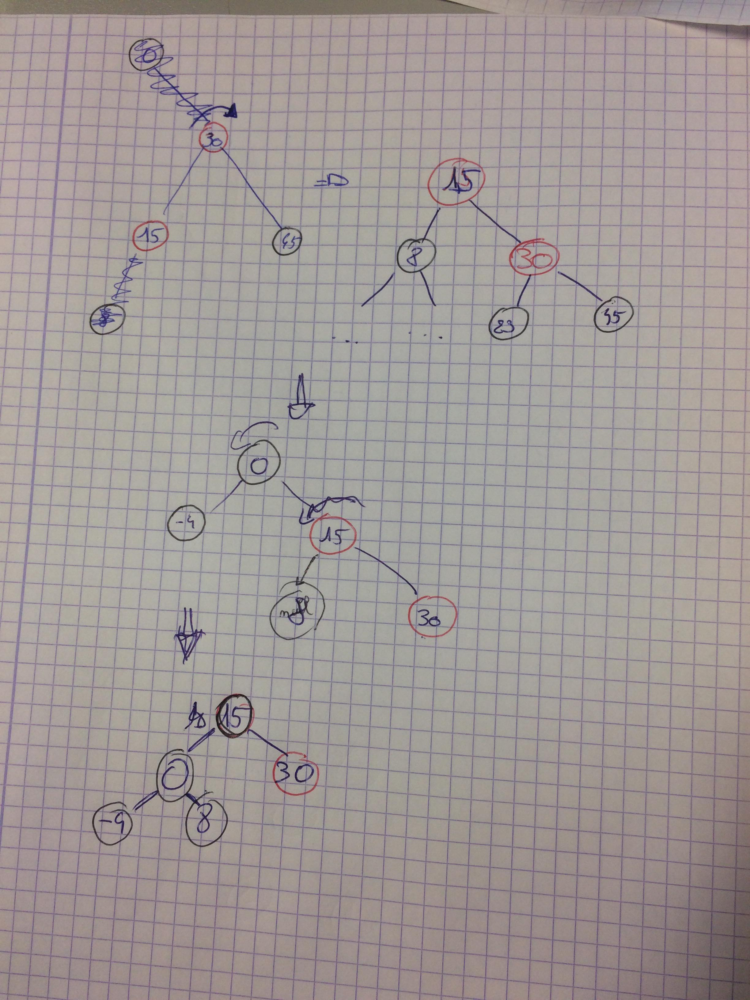

# Schematische voorstelling code

# remarks

- Om de boom op te bouwen, gebasseerd op een foto, `voegtoe()` in dezelfde volgorde als deze door *Breedte-eerst* zouden zijn gevonden. (Dus eerst wortel, dan al deze op eerste diepte....)
- `RepOKZoekboom()` not used. It's written by myself in `RepOK()`.
- All extra functions are at the very end of the header file.

# gebaseerd op
- [mverkerk/Algoritmen2](https://github.ugent.be/mverkerk/Algoritmen2/blob/master/Labo2/rzwboomStijn.h)
- [thdtemme/Gegevensstructuren-en-Algoritmen](https://github.ugent.be/thdtemme/Gegevensstructuren-en-Algoritmen/blob/master/labo7/oef1.cpp)

# Known Issues
- Segmentation fault als root geen twee kinderen heeft. Oorzaak is `RepOK()`

# Oefening
Voeg 6 toe op onderstaande afbeelding.

