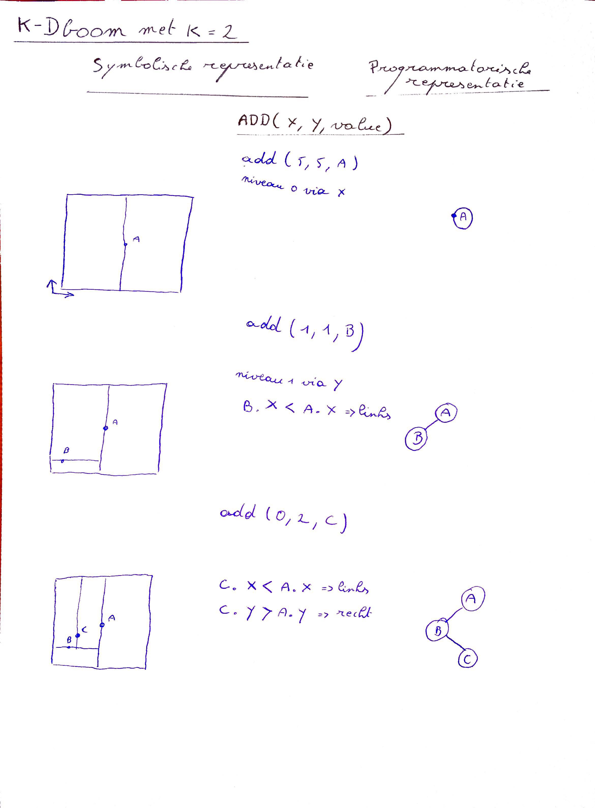
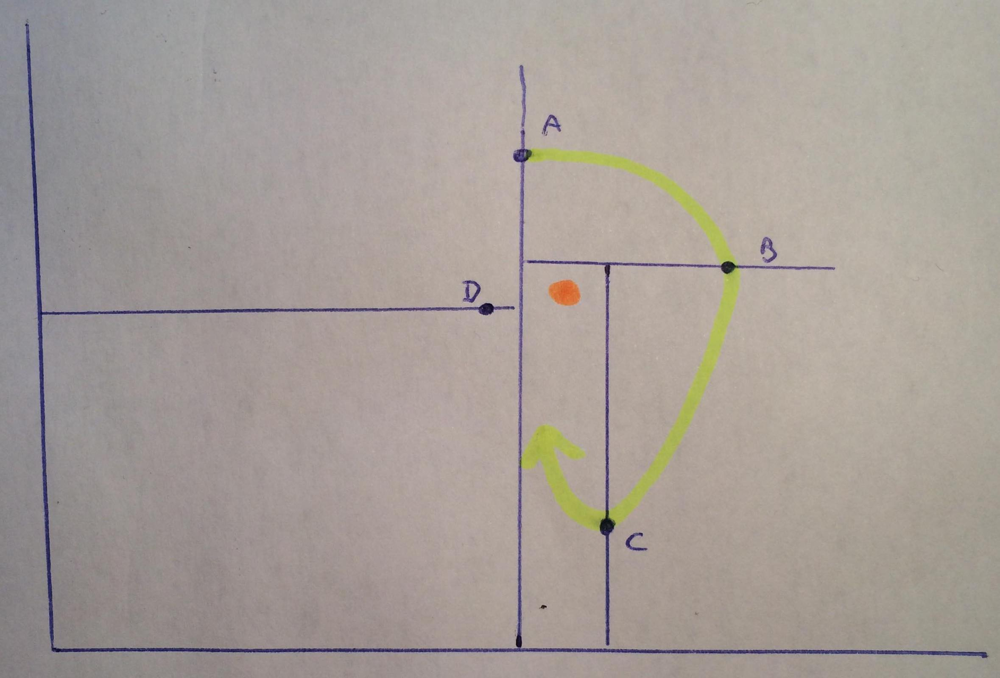
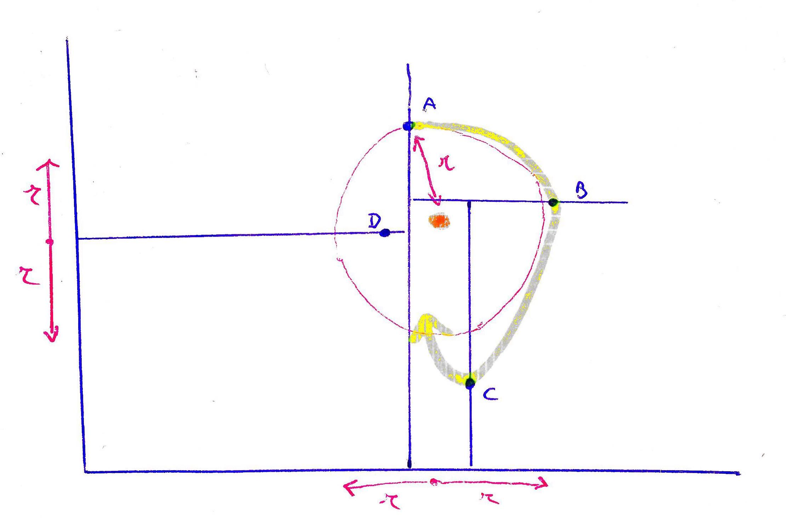

# K-Dboom met k=2

## Toevoegen

## Zoek punt in de buurt van een gegeven punt X
### Deel 1: Snel inzoemen
We moeten een zoekgebied vaststellen. Dit gebeurt door eenvoudig af te dalen in de boom en stoppen bij een blad. Dit blad is relatief dicht maar is niet per se het dichtste punt. Het is wel het dichtste punt langs het gevolgde pad.  
  
Bij het afdalen in de boom hebben we het pad van gele pijl gevolgd. We kwamen eerst bij A. En houden deze afstand bij in `int minDistance`. Toen kwamen we bij B. |BX| was groter dan |AX| dus moeten we `int minDistance` niet aanpassen. Idem voor C.

### Deel 2: Traag uitzoemen
Eens we dit punt vastgeteld hebben weten we dat 'als' er nog een punt bestaat die zich dichter bij het gezochte punt bevindt deze in een radius rond
het gezochte punt valt op een afstand `sqrt( (a.x - b.x)² + (a.y - b.y)² )`

 

Bij het afdalen in het pad zijn we D niet tegengekomen maar deze ligt wel nog dichter. We moeten nu terug stijgen in onze boom. We hebben de voorouders dus bijgehouden in een stack. Bij het stijgen in de boom moeten we knopen vergelijken waarbij x of y binnen het beruik liggen van `X.x + |AX|` en `X.y |AX|`

# Feedback
- Er is een update met code op minerva. Er zat namelijk een bug in de code van de prof.
